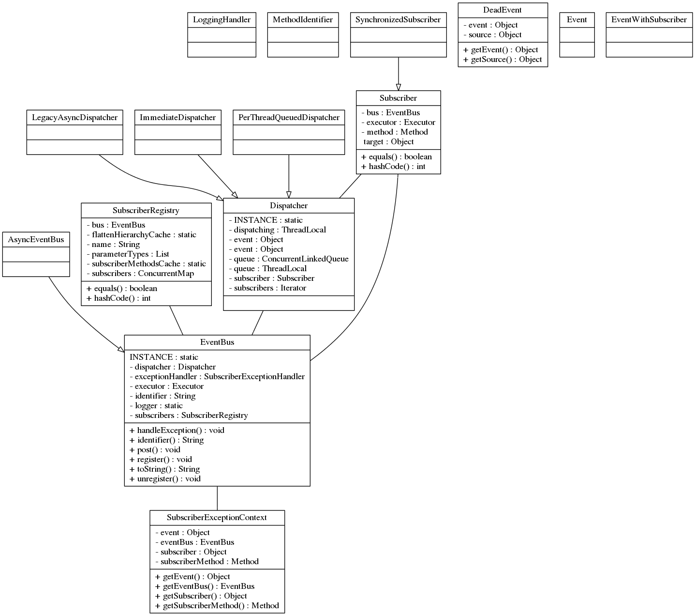
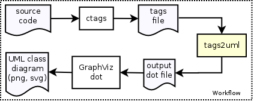

tags2uml
========

Generates UML class diagrams, from source code

[](https://travis-ci.org/ruben2020/tags2uml)    


## Overview
Command line tool to convert from a [Exuberant-ctags](http://ctags.sourceforge.net/) tags file to a [UML class diagram](http://en.wikipedia.org/wiki/Class_diagram), through [Graphviz](http://www.graphviz.org/), for all object oriented languages supported by ctags

The input file is a tags file, generated by Exuberant-ctags using `--fields==+latinK`.

The output file is a Graphviz [DOT file](http://www.graphviz.org/content/dot-language) whose name is specified through the program options, or to stdout. The DOT file should then be passed to the Graphviz `dot` program to be converted into an image file (e.g. PNG, SVG etc.).


## Latest version is v0.01

Windows and Linux binaries can be downloaded at [tags2uml@SourceForge](https://sourceforge.net/projects/tags2uml/files/). The instructions on how to build from source code can be found below.

So far, it has been tested on Linux and Windows 7. It has been tested on C++, Java, Python and C# source code. Work in progress. But it should theoritically work on other object oriented languages supported by ctags and on other platforms supported by [Go](http://golang.org/).


## Features

* Supports C++, Java, Python, Ruby and C# (not all tested yet)
* Can build and run on any platform supported by [Go](http://golang.org/) i.e. Windows, Linux, Mac (Mac not yet tested)
* Whitebox (with methods and members of classes) or blackbox (just class names)
* Ability to show only public methods, only public and protected methods, all methods or no methods
* Ability to show only public members, only public and protected members, all members or no members
* Class inheritance is optionally shown
* Relationship optionally shown, based on the data type of members of a class (only for C++, Java and C#)
* Data type of members and return types of methods of a class (only for C++, Java and C#)


## Example of generated UML class diagram

The DOT file for this was generated using these options:    
`tags2uml --members=1 --methods=1 --infile tags --outfile guava-eventbus.dot`.

This is a whitebox UML class diagram of the [Google Guava EventBus](https://code.google.com/p/guava-libraries/wiki/EventBusExplained), which is set to show all members and methods as well as have inheritance and relationship enabled. This was the [input tags file](doc/tags) that was used and this was the [output DOT file](doc/guava-eventbus.dot) that was generated using tags2uml.




## How to build and install?

First, install the [Go](http://golang.org/) toolchain.

Please see [these instructions](http://golang.org/doc/code.html#Workspaces) on how to setup the `src`, `pkg` and `bin` directories. The `tags2uml` repository should be below `src`    
The `GOPATH` environment variable also needs to be setup according to [these instructions](http://golang.org/doc/code.html#GOPATH) to point to the root directory of the Go projects like this: `export GOPATH=$HOME/goprojects` in Linux, or `set GOPATH=c:/goprojects` in Windows.

Then, run these commands to clone the git repository and then build the source code:    
```bash
git clone https://github.com/ruben2020/tags2uml.git $GOPATH/src/tags2uml
go install tags2uml
```

After doing the above, the executable binary `tags2uml` should appear in `$GOPATH/bin` in Linux. In Windows, the `tags2uml.exe` executable binary should appear in `c:\goprojects\bin`.    
In order to use it directly, you could add it to `PATH` like this: `export PATH=$PATH:$GOPATH/bin` in Linux, or `set PATH=%PATH%;c:\goprojects\bin` in Windows.

In Windows, you may also want to set the `GOROOT` environment variable like this: `set GOROOT=C:/go` to point to the Go tools installation path, and add Go to PATH like this: `set PATH=%PATH%;c:\go`. The method to set the environment variables permanently in Windows can be [found here](http://www.computerhope.com/issues/ch000549.htm).

The method to set the environment variables permanently in Linux is to place the above `export` commands into the `~/.bashrc` file.


## What are the dependencies?

There are no build dependencies, but to use it, you would also need [Exuberant-ctags](http://ctags.sourceforge.net/) and [Graphviz](http://www.graphviz.org/).


## How to use it?

To get more information on how to use this tool, please use `tags2uml --help`.

The workflow looks like this:     


Basic use with default options (with automatic selection of files to be scanned):    
```bash
cd ~/MySourceCode
ctags --fields=+latinK -R
tags2uml --infile tags --outfile MySourceCode.dot
dot -Tpng -oMySourceCode.png MySourceCode.dot
```     

If you want to manually build a list of files to be scanned in Linux:    
```bash
cd ~/MySourceCode
find -iname "*.java" > ./myfiles.txt
ctags --fields=+latinK -L ./myfiles.txt
tags2uml --infile tags --outfile MySourceCode.dot
dot -Tpng -oMySourceCode.png MySourceCode.dot
```     

If you want to manually build a list of files to be scanned in Windows:    
```
cd c:\MySourceCode
dir /b/a/s *.java > myfiles.txt 
ctags --fields=+latinK -L myfiles.txt
tags2uml --infile tags --outfile MySourceCode.dot
dot -Tpng -oMySourceCode.png MySourceCode.dot
```      

Replace `*.java` with relevant extensions.    
You may also want to edit `myfiles.txt` to exclude files that you do not wish to be scanned.


## How is it licensed?

It's free open source software.

It is licensed under the [Apache License 2.0](http://www.apache.org/licenses/LICENSE-2.0.html).    
All DOT files generated using this tool are not subject to this license.


## Can I use it in a commercial environment without purchasing, for an unlimited time?

Yes. However, donations are welcomed.


## Are there any known limitations?

For C++, [inline assembly code](http://en.wikipedia.org/wiki/Inline_assembler) is not supported by ctags. This mainly affects embedded software, OS and driver code.

Please exclude files with inline assembly code from the list of files to be scanned by ctags.


## How can I contribute?

* Report bugs
* Provide feedback, new ideas, suggestions etc. What would you like to see?
* Tell your friends, propose it on StackOverflow, write about it, tweet it
* Fix bugs (see Issues tab)


## List of Contributors

[ruben2020](https://github.com/ruben2020)    
(More welcomed)


## Credits

We thank the people behind the following projects:    
[Exuberant-ctags](http://ctags.sourceforge.net/)   
[Graphviz](http://www.graphviz.org/)    
[Go](http://golang.org/)    

